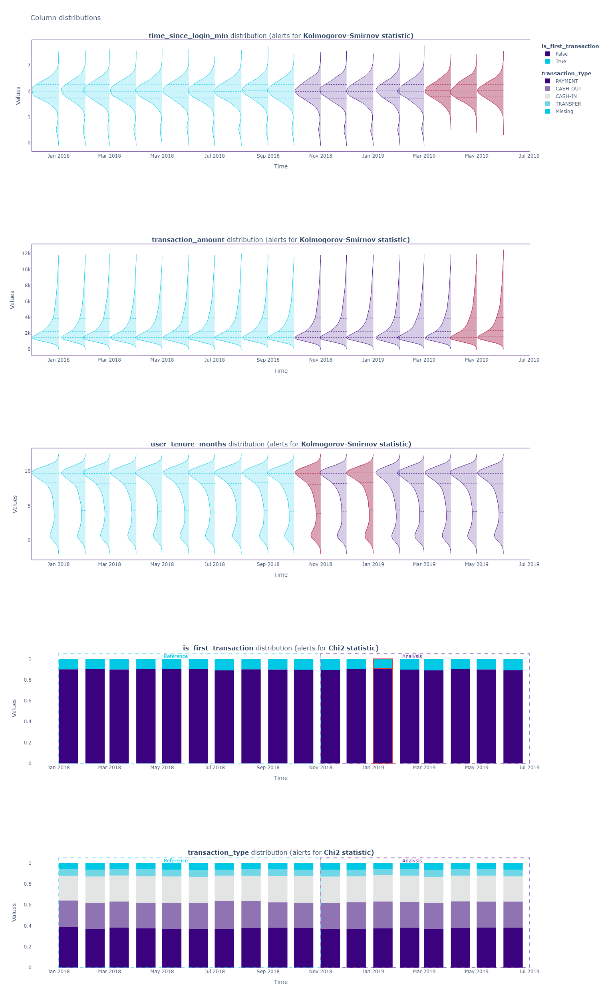

# Fraud Detection Project

London's Poundbank needs help to figure out why their fraud detection models aren't as accurate anymore.

Poundbank recommends the `nannyml` library for monitoring machine learning models, which is also their tool of choice. Poundbank asks for the following objectives to look into:

1. Identify the months in which the estimated(expected) and realized(actual) accuracy of the model triggers alerts.  
2. Determine the feature that shows the most drift between the reference and analysis sets, thereby impacting the drop in realized accuracy the most. Historically, Poundbank's data science team used the Kolmogorov-Smirnov and Chi-square methods to detect this drift.
3. Look for instances where the monthly average transaction amount differs from the usual, causing an alert.
4. Use the univariate drift detection method to figure out why the accuracy dropped. Think of a possible explanation.


Poundbank has provided a reference(test data) and analysis set(production data). The reference set can be found [here](https://github.com/Elijah-Rodriguez/data-analysis/blob/main/Fraud%20Detection/reference.csv) and the analysis set can be found [here](https://github.com/Elijah-Rodriguez/data-analysis/blob/main/Fraud%20Detection/analysis.csv). The python notebook can be found here(https://github.com/Elijah-Rodriguez/data-analysis/blob/main/Fraud%20Detection/model_monitoring.ipynb).

## Data
A summary and preview of the reference and analysis sets are provided below.

| Column     | Description              |
|------------|--------------------------|
| `'timestamp'` | Date of the transaction. |
| `'time_since_login_min'` | Time since the user logged in to the app. |
| `'transaction_amount'` | The amount of Pounds(£) that users sent to another account. |
| `'transaction_type'` | Transaction type: <ul><li>`CASH-OUT` - Withdrawing money from an account.</li><li>`PAYMENT` - Transaction where a payment is made to a third party.</li><li>`CASH-IN` - This is the opposite of a cash-out. It involves depositing money into an account.</li><li>`TRANSFER` - Transaction which involves moving funds from one account to another.</li> |
| `'is_first_transaction'` | A binary indicator denoting if the transaction is the user's first (1 for the first transaction, 0 otherwise). |
| `'user_tenure_months'` | The duration in months since the user's account was created or since they became a member. |
| `'is_fraud'` | A binary label indicating whether the transaction is fraudulent (1 for fraud, 0 otherwise). |
| `'predicted_fraud_proba'` | The probability assigned by a detection model indicates the likelihood of a fraudulent transaction. |
| `'predicted_fraud'` |  The predicted classification label is calculated based on predicted fraud probability by the detection model (1 for predicted fraud, 0 otherwise). |

## Tools
**Python, Pandas library, nannyml library.**

## Objective 1

**Identify the months in which the estimated(expected) and realized(actual) accuracy of the model triggers alerts.**  

In this scenario, I am a post-deployment Data Analyst that is monitering Poundbank's fraud detection model. This means there is no data cleaning to be done as this leans more into general analysis and machine learning. I can estimate the model's performance by first using nannyml's CBPE estimator:

```python
cbpe = nml.CBPE(
    timestamp_column_name="timestamp",
    y_true="is_fraud",
    y_pred="predicted_fraud",
    y_pred_proba="predicted_fraud_proba",
    problem_type="classification_binary",
    metrics=["accuracy"],
    chunk_period="m"
)

cbpe.fit(reference)
est_results = cbpe.estimate(analysis)
```

The realized accuracy can be found by using nannyml's performance calculator:

```python
calculator = nml.PerformanceCalculator(
    y_true="is_fraud",
    y_pred="predicted_fraud",
    y_pred_proba="predicted_fraud_proba",
    timestamp_column_name="timestamp",
    metrics=["accuracy"],
    chunk_period="m",
    problem_type="classification_binary",
)
calculator = calculator.fit(reference)
calc_results = calculator.calculate(analysis)
```

With the estimated and realized accuracies saved, a comparison plot can now be created to observe which months trigger alerts:

```python
est_results.compare(calc_results).plot().show()
```

Comparison Plot:


From the plot, it can be seen that there are 3 months where both the expected and realized accuracy of the model triggered an alert. These months are April 2019, May 2019 and June 2019. With these months identified, they can be stored into a variable for future analysis or as part of a deliverable for a final report:

```python
months_with_performance_alerts = ["april_2019", "may_2019", "june_2019"]
print(months_with_performance_alerts)
```

## Objective 2

**Determine the feature that shows the most drift between the reference and analysis sets, thereby impacting the drop in realized accuracy the most. Historically, Poundbank's data science team used the Kolmogorov-Smirnov and Chi-square methods to detect this drift.**

To determine which feature has the highest correlation, I first have to make a list of all the relevant features from the dataset to feed into the `UnivariateDriftCalculator()`. With the list made, the calculator can be intialized and use Poundbank's standard methods:

```python
features = ["time_since_login_min", "transaction_amount",
            "transaction_type", "is_first_transaction", 
            "user_tenure_months"]

# Calculate the univariate drift results
udc = nml.UnivariateDriftCalculator(
    timestamp_column_name="timestamp",
    column_names=features,
    chunk_period="m",
    continuous_methods=["kolmogorov_smirnov"],
    categorical_methods=["chi2"]
)

udc.fit(reference)
udc_results = udc.calculate(analysis)
```
With the results saved, I can now use the Correlation Ranker to determine which feature has the highest correlation with drift and display this information in a plot:

```python
# Use the correlation ranker
ranker = nml.CorrelationRanker()
ranker.fit(
    calc_results.filter(period="reference"))

correlation_ranked_features = ranker.rank(udc_results, calc_results)

# Find the highest correlating feature
display(correlation_ranked_features)
```

Result:


Based on the dataframe, it can be seen that the column that affects drift the most is the `time_since_login_min` column. As per Poundbank's request, this can be stored in a variable for potential use if more analysis needs to be done.

## Objective 3

**Look for instances where the monthly average transaction amount differs from the usual, causing an alert.**

Identifying alerts can be done by using the summary average statistics calculator and plotting the results to view where any alerts could have happened:

```python
# Calculate average monthly transactions
calc = nml.SummaryStatsAvgCalculator(
    column_names=["transaction_amount"],
    chunk_period="m",
    timestamp_column_name="timestamp",
)

calc.fit(reference)
stats_avg_results = calc.calculate(analysis)

# Find the month
stats_avg_results.plot().show()
```

Result:


Based on the plot, there was only one alert triggered and it was during June 2019. The transaction amount that triggered the alert was $3069.8184.

## Objective 4

**Use the univariate drift detection method to figure out why the accuracy dropped. Think of a possible explanation.**

To get a basic overview as to why the accuracy dropped, a distribution of all features can be called to view any observations:

```python
udc_results.filter(column_names=features).plot(kind="distribution")
```

Result:



Based on the distribution plots, some observations can be made. First, the `time_since_log_min` distribution shows that from April to June, the transactions made within one minute after logging in completely vanished. Also, the `transaction_amount` distribution shows that in May and June, a larger number of transactions appeared. Additionally, the average transaction value has increased and raised an alert, as noted during Objective 3.

Fraudsters may have noticed that early card transactions, when done right after logging in, often led to account blocking. As a result, they may have started waiting a bit longer before transferring money to their account to avoid detection. Furthermore, they tend to make a single larger transfer instead of many smaller ones, leading to an increase in the average transaction value to avoid triggering an alert.

## Conclusion

While Poundbank's model may not have performed as accurately as the bank initially wanted, their request to analyze the performance allowed for some valuable insight. Potential loopholes have been discovered that could explain why some fradulent moves are not being flagged. It would be worthwhile to investigate the `time_since_log_min` column more to be able to tackle this possible explanation.
