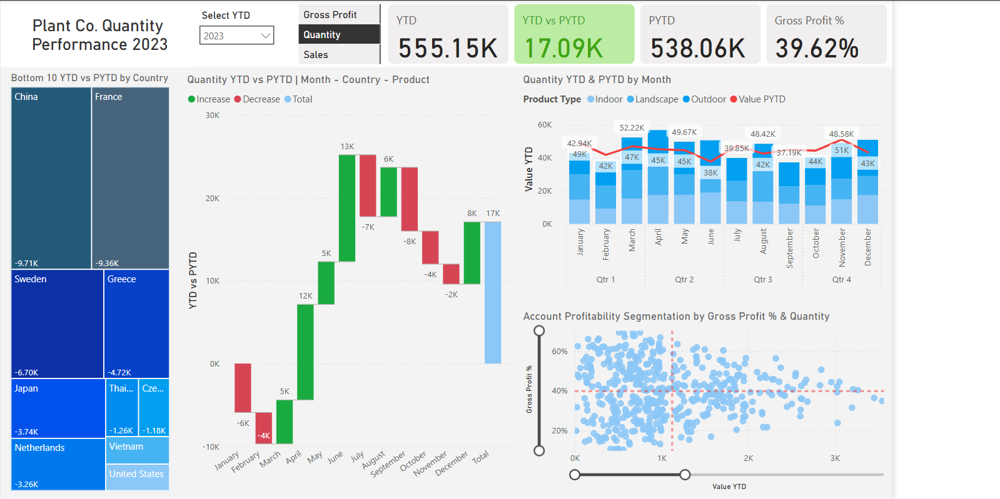

# Plant Co. Dynamic Sales Performance (2022-Q12024) Dashboard

This project explores the fictional company of Plant Co. to organize 3 tables of data into a dynamic dashboard for the end user. The dashboard is best used to identify problem areas within the company, such as locations or products that may be underperforming, as well as noting aspects of growth that occur within the 2 year period. The end user is able to dynamically track gross profit, quantity and sales metrics while viewing comparisons between the previous year-to-date.



Access the published report [here](https://app.fabric.microsoft.com/groups/me/reports/b4b39cf2-1ed7-48d2-886f-2631e3ab6ee8/c154c62908eb290d2b91?experience=fabric-developer) or download the .pbix file [here](https://github.com/Elijah-Rodriguez/data-analysis/blob/main/Sales%20Dashboard/Plant%20Co%20Performance%20Report.pbix).

## Dataset

This dataset is comprised of 3 seperate tables: 
- Plant_FACT: This table is sales invoiced and contains product IDs, total sales per product, quantity, price, cost of goods, the date the invoice was logged and the account ID.
- Accounts: This stores all the unique accounts on file and includes country codes, account names, master ID, account ID, latitude/longitude, country, postal code, street name and street number.
- Plant_Hierarchy: This table stores all the relevant information for products such as product family, product family ID, product group, product group ID, product name, product name ID, product size and product type.

After data cleaning, this is the relationship betweeen the data:


Inspired by [Mo Chen](https://github.com/mochen862).

Original dataset available [here](https://github.com/Elijah-Rodriguez/data-analysis/blob/main/Plant%20Co%20Performance%20Dashboard/Plant_DTS.xls).

## Tools
PostgreSQL, Microsoft PowerBI

## Process

### Data Cleaning
- Some column names contained spelling errors and needed to be corrected. This was done simply with PostgreSQL using the following code snippet:
  
```sql
ALTER TABLE plant_hierarchy 
RENAME COLUMN Produt_Type TO Product_Type; 
```

- Formatting was clean upon inspecting the dataset within a PostgreSQL database as I transitioned to importing the data into PowerQuery.
- Only 3 additional changes happened after importing the data: Removing duplicate entries in all ID columns, confirming the Date_Time column within the Plant_FACT table was using the correct datatype, and renaming the tables to be consistent. Plant_FACT was renamed to Fact_sales, Accounts was renamed to Dim_Accounts and Plant_Hierarchy was renamed to Dim_Product.

### Data Modeling
- After cleaning and importing the data, my next step was creating the basic measures that would be needed for KPI tracking and calculations. These included measures such as total sales, quantity, gross profit, and values for a switch that will be added later.
- These measures were created using simple DAX functions such as SUM() and SWITCH().
- I brought these measures into a simple table in the report view to confirm no errors in the functions before moving on to create the visuals for the dashboard.

### Dashboard Development
- Standard cards, scatter plots, and stacked line charts were added to begin displaying key KPIs such as Gross Profit percentage, YTD comparisons and profitablility.
- A treemap was added to demonstate the bottom 10 countries that had the highest difference between YTD and PYTD values.
- A waterfall chart was added to allow the opportunity to drill down and analyze specific countries and product type to correctly identify problem locations and products.
- All charts include a dynamic title and result that updates after changing the YTD as well as the tracked metric.

## Conclusion
By analyzing the waterfall chart, it's clear that landscape products in Canada during 2024 were underperforming. The end user can use this analysis, as well as noting that Canada exceeded their PYTD during Feburary to investigate why landscape products are not selling and what were the conditions that made February such a successful month for the company. This would allow Plant Co. to allocate resources more stragetically and make more confident decisions as the year progresses. 

