# Taste of the World Cafe Order Analysis Project

This project explores creating queries for the fictional company Taste of the World Cafe. Taste of the World Cafe has launched a change to their menu recently and would like to gain some insights into how well the new menu is performing over the first fiscal quarter of 2023. Taste of the World has outlined 3 main objectives to follow, each with their own sub-objectives to query for. The 3 main objectives are:

1. Explore the menu_items table to get familiar with the new menu and query for some tracked metrics.
2. Explore the order_details table to gain an overview of volume and general performance over the quarter.
3. Join the two tables and analyze the performance of the new menu.

The original dataset can be downloaded by csv or MySQL [here](https://mavenanalytics.io/data-playground?order=date_added%2Cdesc&pageSize=10&search=Restaurant%20Orders) as well as within this repository in csv form. 

## Tools
**Microsoft Excel**, **PostgreSQL**

This dataset was cleaned in Microsoft Excel by replacing all NULL values with 0. After cleaning, the csvs were imported into pgAdmin 4 to be queried with PostgreSQL.

## Objective 1
Taste of the World asked to write these queries in response to these questions:

**1. What are the total number of items on the updated menu?**

PostgreSQL Query:
```sql
SELECT COUNT(*) 
FROM menu_items;
```

Result:

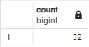


**2. What are the least and most expensive items on the menu?**

PostgreSQL Query:
```sql
SELECT*
FROM menu_items
WHERE price IN (SELECT MAX(price) FROM menu_items) 
OR price IN (SELECT MIN(price) FROM menu_items);
```

Result:

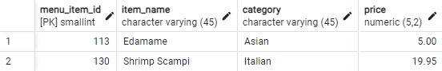

Edamame is the least expensive item on the menu, while Shrimp Scampi is the most expensive item.


**3. What are the least and most expensive Italian dishes on the menu?**
   
PostgreSQL Query:
```sql
SELECT*
FROM menu_items
WHERE category='Italian'
ORDER BY price;
```

Result:

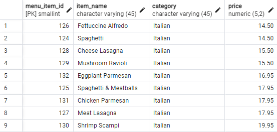

Fettuccine is the least expensive Italian item on the menu, while Shrimp Scampi is the most expensive item.


**4. How many dishes are in each category?**

PostgreSQL Query:
```sql
SELECT category, COUNT(menu_item_id) as num_dishes
FROM menu_items
GROUP BY category;
```

Result:

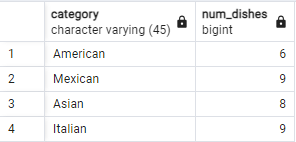


**5. What is the average dish price within each category?**

PostgreSQL Query:
```sql
SELECT category, ROUND(AVG(price), 2)
FROM menu_items
GROUP BY category;
```

Result:

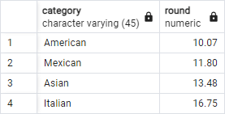

## Objective 2
Taste of the World asked to write these queries in response to these questions:

**1. What is the date range of the order table?**

PostgreSQL Query:
```sql
SELECT
MIN (order_date) as  min_date,
MAX (order_date) as max_date
FROM order_details;
```

Result:

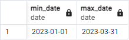

The date range is 1/1/2023 - 3/31/2023.
   

**2. How many orders were made within this date range?**

PostgreSQL Query:
```sql
SELECT COUNT(DISTINCT order_id)
FROM order_details;
```

Result:

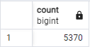

**3. Which orders had the most amount of items?**

PostgreSQL Query:
```sql
SELECT order_id, COUNT(item_id) as num_items
FROM order_details
GROUP BY order_id
ORDER BY num_items DESC;
```

Result:

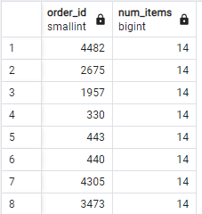


**4. How many orders had more than 12 items?**

PostgreSQL Query:
```sql
SELECT COUNT(*)FROM
(SELECT order_id, COUNT(item_id) as num_items
FROM order_details
GROUP BY order_id
HAVING COUNT(item_id) > 12) as num_orders;
```

Result:

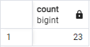

## Objective 3
Taste of the World asked to write these queries in response to these questions:

**1. Combine the menu_items and order_details tables into one table.**

PostgreSQL Query:
```sql
SELECT*
FROM order_details od LEFT JOIN menu_items mi
	ON od.item_id = mi.menu_item_id;
```

Result:

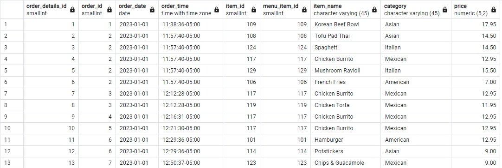

**2. What were the least and most ordered items? What categories were they in?**

PostgreSQL Query:
```sql
SELECT item_name, category, COUNT(order_details_id) as num_purchases
FROM order_details od LEFT JOIN menu_items mi
	ON od.item_id = mi.menu_item_id
GROUP BY item_name, category
ORDER BY num_purchases;
```

Results:

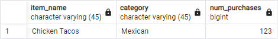

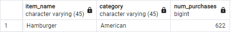

**3. What were the top 5 orders that spent the most money?**

PostgreSQL Query:
```sql
SELECT order_id, SUM(price) as total_spent
FROM order_details od LEFT JOIN menu_items mi
	ON od.item_id = mi.menu_item_id
WHERE price IS NOT NULL
GROUP BY order_id
ORDER BY total_spent DESC
LIMIT 5;
```

Result:

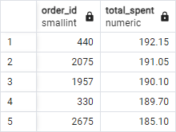

**4. View the details of the highest spent order. What insights can you gather from the data?**

PostgreSQL Query:
```sql
SELECT category, COUNT(item_id) as num_items
FROM order_details od LEFT JOIN menu_items mi
	ON od.item_id = mi.menu_item_id
WHERE order_id = 440
GROUP BY category;
```

Result:

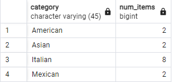

Interestingly, even though American food is cheaper on average and the most popular dish type, the largest order consisted of Italian food the most. Italian food has the highest average price per dish and boasts the overall most expensive item on the menu. This could indicate that the quality of the food is considerably above the rest and can justify its continuation on the menu. 

**5. View the details of the top 5 highest spending orders. What insights can you gather from the data?**

PostgreSQL Query:
```sql
SELECT order_id, category, COUNT(item_id) as num_items
FROM order_details od LEFT JOIN menu_items mi
	ON od.item_id = mi.menu_item_id
WHERE order_id IN (440, 2075, 1957, 330, 2675)
GROUP BY order_id, category; 
```

Result:

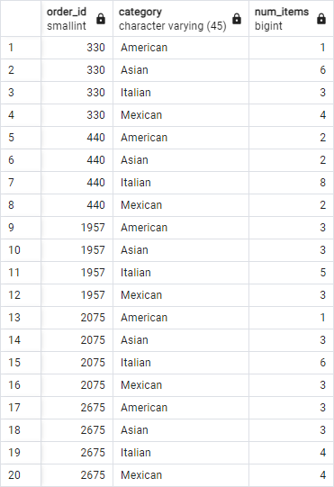

Among the top 5 highest spending orders, Italian food dominated with 26 total orders. Shockingly, American food was ordered only 10 times among the 5 large orders. Assuming these orders are large parties of people dining in or ordering out, they may be more inclined to spend a larger amount of money if they believe the quality justifies the price as well as Italian food being extremely popular globally and in the United States. American food is still the cheaper option at Taste of the World, this may be the more popular option among people who eat by themselves or in a small group. Asian and Mexican food are performing closer to the standard of American food among the top 5 highest orders.


## Recommendations

Based on the exploration of this data, it is clear that American and Italian food are performing very well for their respective purposes. A full fiscal year's worth of data would be the next logical step to compare quarterly performance among the various categories and to notice any trends among seasons which could influence the menu's performance. It would be worthwhile to potentially phase out Mexican food as it is among the least popular dishes and has as many dishes as Italian food. Phasing this out could save costs and allow for seasonal moments to re-introduce a smaller section of Mexican dishes.

